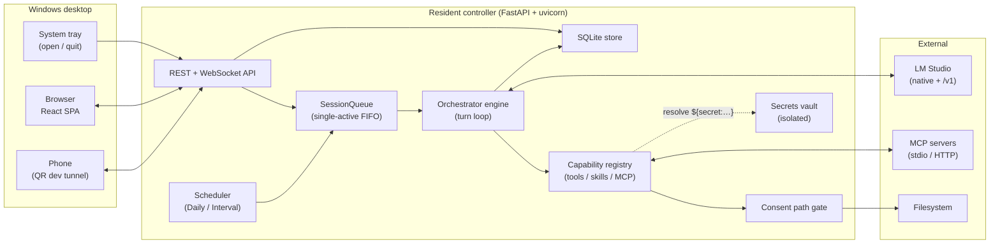
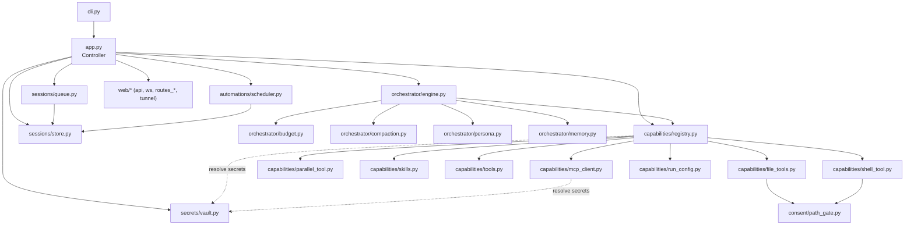
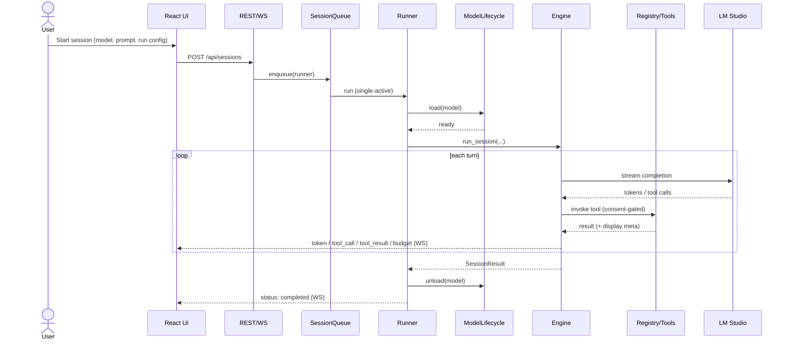
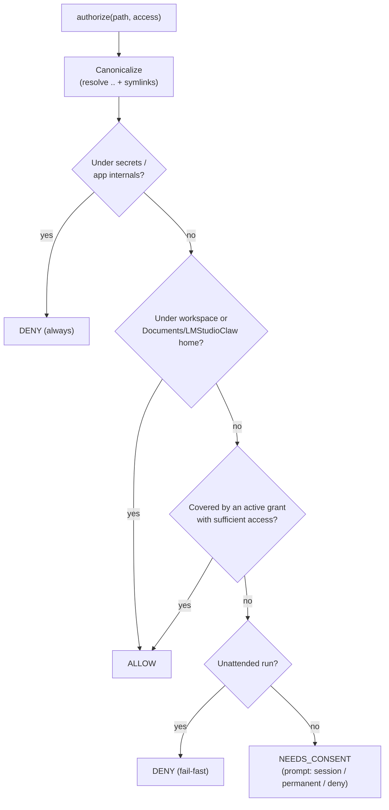

# Architecture — LMStudioClaw (Call-Based Agent Runtime)

This document describes the modules, data/control flow, integration points, invariants,
and extension points of the agent runtime. See [README.md](README.md) for the
human-facing overview and [specs/001-agent-runtime/](specs/001-agent-runtime/) for the
full design (spec, plan, contracts, data model).

## Overview

A resident **controller** (system tray + local web UI) runs while the PC is on with
**no model loaded at idle**. On a manual session or a fired automation it loads the
chosen model, runs an interactive multi-turn agent loop (streaming, steering, queuing,
stop, automatic context compaction) using enabled skills/tools/MCP servers within a
hierarchical, least-privilege folder-consent boundary, then unloads the model and
records the session. Exactly one session runs at a time (FIFO queue).



## Module map

```text
lmstudioclaw/
├── cli.py                  # Thin entry point: free-port selection, tray, uvicorn
├── app.py                  # Controller: wires services, lifespan, session coordination
├── config/
│   ├── paths.py            # Documents layout + isolated %APPDATA% secrets path + bootstrap
│   └── settings.py         # File-backed settings singleton (safe defaults)
├── model/
│   ├── catalog.py          # LM Studio connection + one-call model discovery (no polling)
│   ├── lifecycle.py        # load / unload / warmup / orphan-detect (single-model invariant)
│   └── context_prefs.py    # per-model context clamp [1024, max]
├── orchestrator/
│   ├── engine.py           # interactive turn loop: stream, tool calls, steer/queue/stop
│   ├── budget.py           # token estimate + context-window allocation
│   ├── compaction.py       # ~90% summarize-and-replace compression
│   ├── persona.py          # persona resolution (default + library)
│   └── memory.py           # durable agent learnings (Documents memory/ area)
├── capabilities/
│   ├── registry.py         # unified capability surface + default toolset + per-run effective_tools
│   ├── run_config.py       # RunConfig: per-run model + tool overrides + MCP selection (002)
│   ├── file_tools.py       # read(range)/list_dir/write/edit(exact|line-range)/grep/find (002)
│   ├── shell_tool.py       # consent-gated, workspace-rooted PowerShell tool (002)
│   ├── parallel_tool.py    # parallel meta-tool: run >=2 independent sub-calls concurrently (002)
│   ├── skills.py           # SKILL.md discovery/validation + referenced scripts
│   ├── tools.py            # custom python tools (trust gate, in-process exec)
│   └── mcp_client.py       # MCP servers (stdio + HTTP/SSE w/ auth headers) via `mcp` SDK
├── consent/
│   └── path_gate.py        # canonicalize + workspace/home allow + hierarchical grant + hard deny-list
├── automations/
│   └── scheduler.py        # event-driven Daily/Interval scheduler + missed-run detection
├── sessions/
│   ├── queue.py            # single-active-session FIFO, persisted + restored on startup (002)
│   └── store.py            # SQLite (best-effort) + retention pruning + queued_runs + run_config
├── secrets/
│   └── vault.py            # isolated secrets store (user-only writes, no agent read path)
├── notifications/
│   └── toast.py            # Windows toast notifications (never contain secrets)
├── web/
│   ├── api.py              # FastAPI app factory + static SPA mount + /ws/status + health
│   ├── tunnel.py           # opt-in VS Code dev tunnel + QR ("See this on your phone")
│   ├── ws.py               # session hub + StatusHub (app-wide live model/run/queue) (002)
│   ├── routes_*.py         # REST route groups (sessions, automations, capabilities, settings)
│   └── static/             # built React SPA (from frontend/): fluid ~90vw, runbar + queue panel (002)
└── tray/
    └── icon.py             # pystray tray: Open (browser) / Quit (graceful shutdown)
```

### Module relationships



## Feature 002 additions (UI, toolset, concurrency, per-run config)

- **Default toolset** (`capabilities/file_tools.py`, `shell_tool.py`, `parallel_tool.py`):
  `read_file` (optional line range), `list_dir`, `write_file`, `edit` (overloaded —
  exact-string find/replace *or* line-range replace), `grep`, `find`, `powershell`
  (workspace-rooted, consent-gated, timeout + truncation), and `parallel` (runs ≥2
  independent sub-calls via `asyncio.gather`, rejecting same-target mutations). All
  file/shell access still routes through `consent/path_gate.py`.
- **Per-run config** (`capabilities/run_config.py`): `RunConfig{model, tool_overrides,
  mcp_selection}` attached to sessions/automations. `CapabilityRegistry.effective_tools`
  resolves the per-run toolset *most-granular-wins* (MCP selection → per-tool overrides)
  without mutating global state; the engine uses it each turn. Skills are never per-run.
- **Single-run concurrency, visible + durable**: the `SessionQueue` stays single-active
  FIFO and now persists each run in `queued_runs`; `restore_from_store` re-enqueues
  pending runs on startup and an interrupted in-progress run is reconciled (recorded as
  interrupted, not silently replayed).
- **Live UI**: a single app-wide `StatusHub` (`/ws/status`) pushes `model_status` /
  `run_status` / `queue` events (no polling). The SPA shell mounts a top-right run
  indicator + collapsible queue panel (`static/views/runbar.js`), uses a fluid ~90vw
  layout, and gives non-blocking "Load model" feedback. The status channel replays a
  full snapshot on (re)connect so the UI recovers after a dropped channel.
- **MCP transports** (`capabilities/mcp_client.py`): servers in `mcp.json` use the
  standard config shape. Local servers use `command`/`args`/`env` (stdio); remote
  servers use `type` (`"http"` Streamable HTTP or `"sse"`) + `url` + optional auth
  `headers` (e.g. `Authorization: Bearer …`). `McpServer.transport` resolves the
  effective transport and `_with_session` routes to the stdio/streamable-HTTP/SSE
  client. Auth keys live only in `headers` and are never logged. `env`/`headers` values
  may be `"${secret:REF_NAME}"`; `CapabilityRegistry._resolve_secrets` swaps them for the
  stored value via the vault at connect time only (never persisted resolved, never shown).
- **Implicit home consent** (`consent/path_gate.py`): the whole
  `Documents/LMStudioClaw` home (skills/tools/workspace/memory/`mcp.json`) is allowed
  without a prompt — the deny-list (secrets + app internals) is evaluated first and
  still wins. The agent's system prompt advertises the home layout + `mcp.json`
  location and format so it edits config directly instead of probing drives.
- **Tool-action UI** (`ToolResult.meta` → `tool_result` event → `components/ToolCard.jsx`):
  file tools attach display-only `meta` (action + before/after snapshots). The
  transcript renders each action as a readable card ("Read X", "Created Y",
  "Edited Z  +n −m") with an expandable side-by-side diff for writes/edits, full
  contents for a new file, and a note for deletions. `meta` never enters the model
  context (only `output` does); diff rendering lives in `frontend/src/lib/diff.js`.
  Tool turns are persisted and rebuilt into cards on reload (`SessionDetail.restoreMessages`).
- **Session snapshot replay** (`web/ws.py` `SessionHub`): each channel caches the last
  `budget` event + working/idle (`turn`) state and replays them to a socket on
  (re)connect, so a reloaded mid-run session shows the token gauge and correct Stop-turn
  state immediately (no `0/0` until the next turn).

## Later refinements (MCP, secrets, mobile, QoL)

- **MCP per-tool granularity**: MCP tool lists (name + description) are persisted in the
  capability row `metadata` on connect, so the run-config UI renders a server→tools tree
  (VS Code style) with hover descriptions. Unchecking a tool adds
  `tool_overrides["{server}__{tool}"]=false`; unchecking a server drops it from
  `mcp_selection`. `/api/tools` returns the per-server tool detail.
- **MCP input/output cards**: MCP `ToolResult.meta` carries `server`/`tool` + `input`/
  `output`; `ToolCard.jsx` shows an expandable input→output panel.
- **Windows command launch**: `mcp_client._resolve_stdio_command` resolves a stdio
  `command` on PATH and runs `.cmd`/`.bat` shims (e.g. `npx`) via `cmd /c` (fixes
  `WinError 193`); `open-in-vscode` does the same for the `code` launcher.
- **Robust MCP errors**: anyio `ExceptionGroup`s from the SDK are flattened to the real
  cause; a `connect_failed` server shows the reason + **Fix in VS Code**.
- **Secret lifecycle**: secrets can be renamed/updated (write-only) via `PATCH
  /api/secrets/{ref}`; a rename rewrites `${secret:OLD}` references in `mcp.json`. The
  UI prompts for any `${secret:…}` referenced but not yet stored (`/api/secrets/missing`).
- **Phone tunnel** (`web/tunnel.py`): opt-in VS Code dev tunnel
  (`devtunnel host -p <port> --allow-anonymous`) + a `qrcode` SVG, exposed via
  `/api/tunnel[/start|/stop]`; stopped on shutdown.
- **Start-with-a-prompt**: a manual session can carry an `initial_message` delivered as
  the first user turn (echoed live via a `user_message` event).
- **Responsive UI**: `frontend/src/theme.css` collapses the layout for phones/tablets
  (stacked nav dropdown, tables → cards, single-column diffs/IO, full-width composer).

## Control flow (a session)

1. `web/routes_sessions.py` (manual) or `automations/scheduler.py` (automation) asks the
   `Controller` to start a session.
2. The `Controller` creates a `Session` row (`queued`) and enqueues a runner on the
   `SessionQueue`.
3. The queue runs one runner at a time. The runner:
   - prepares the capability registry (skills/tools/MCP + memory tools, scoped),
   - loads the model via `ModelLifecycle` (`loading` → `active`),
   - runs `Engine.run_session`, which streams tokens, dispatches tool calls through the
     `CapabilityRegistry` (file I/O via the `PathGate`), compacts at the budget threshold,
     and honors steer/queue/stop signals from the WebSocket,
   - on any terminal state **always unloads the model** and clears session-scoped grants,
   - records the result and prunes old history.
4. Events flow `Engine → on_event → SessionHub.broadcast → WebSocket → browser`.



## Consent path gate

Every agent file/shell access is authorized by `consent/path_gate.py`. The deny-list is
evaluated **first**, so it always wins; the workspace and the whole
`Documents/LMStudioClaw` home are allowed without a prompt; other paths are checked
against hierarchical, least-privilege grants and otherwise prompt (interactive) or
fail-fast (unattended automations).



## Integration points

- **LM Studio native API** (`/api/v1/models[/load|/unload]`) via `httpx` — model catalog
  and lifecycle (reused from the original app).
- **LM Studio OpenAI-compatible API** (`/v1`) via the `openai` async client — chat
  streaming + tool calling and compaction summaries.
- **MCP servers** via the official `mcp` SDK — external tools over stdio or HTTP/SSE
  (auth keys carried in request headers).
- **VS Code** via the `code` CLI — `POST /api/open-in-vscode` opens referenced files.

## Invariants

- **At most one model loaded** (single-active FIFO queue); idle = zero models.
- **Every terminal session unloads the model.**
- **All agent file I/O passes the `PathGate`**; the secrets area and app internals are a
  hard deny-list regardless of grants; the workspace and the `Documents/LMStudioClaw`
  home are always allowed (no prompt); other grants are hierarchical and least-privilege
  (read ≠ write).
- **Secrets never reach the agent** — no `get_value` is exposed; only runtime `inject`.
  A stored secret can be used by MCP servers (`${secret:REF}` in `env`/`headers`), custom
  tools (module `SECRETS` → `_secrets` kwarg), and skills (front-matter `secrets:` → script
  env vars), all resolved via `CapabilityRegistry._secret_env`/`_resolve_secrets`.
- **No idle polling** of LM Studio; the scheduler sleeps until the next fire.
- **Best-effort persistence** — storage hiccups never crash the controller.

## Extension points (plug-and-play)

- **Skills**: drop a `SKILL.md` folder under `Documents/LMStudioClaw/skills/`.
- **Custom tools**: drop a `.py` module under `tools/` (requires trust confirmation).
- **MCP servers**: add an entry to `mcp.json` (or via the UI / agent) — stdio
  (`command`/`args`/`env`) or HTTP (`type`/`url`/`headers` for auth).
- **Personas**: managed in Settings; the default is editable but not deletable.

Adding any capability only touches its files plus a registry row — no other module changes.
