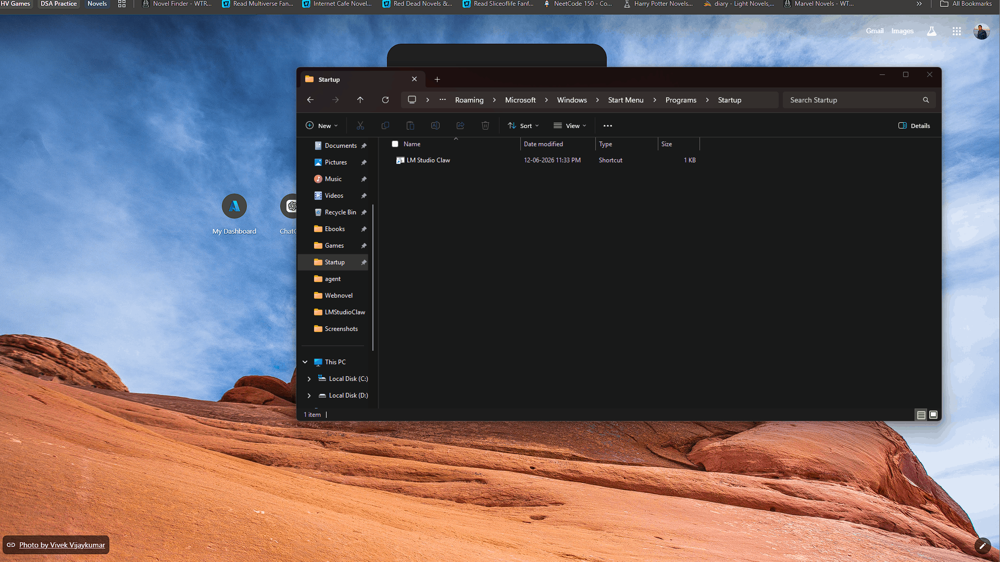
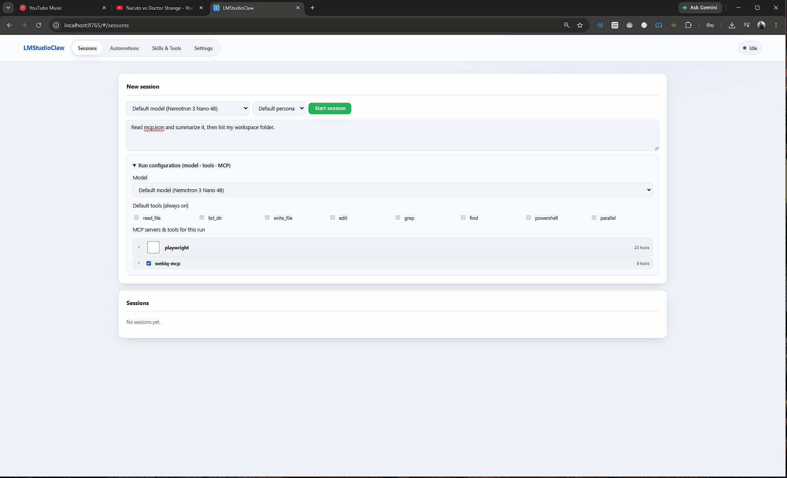
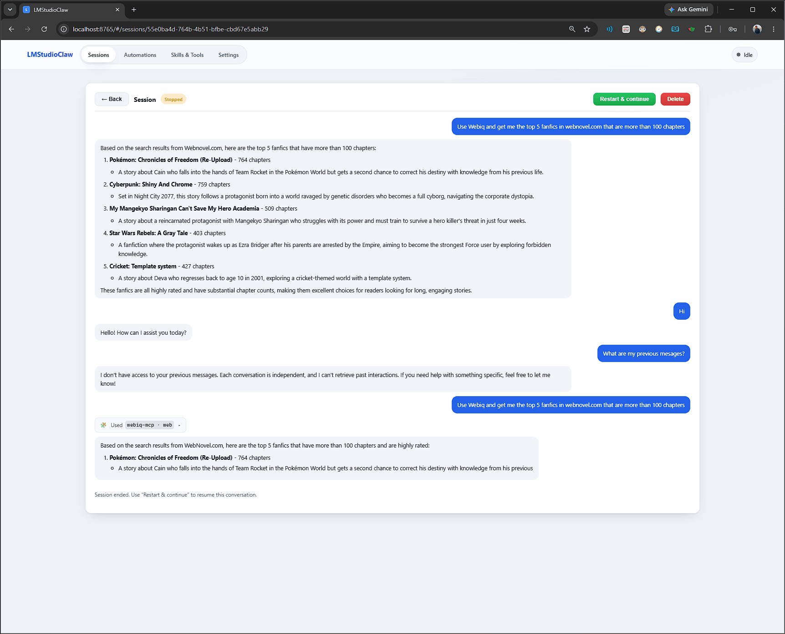
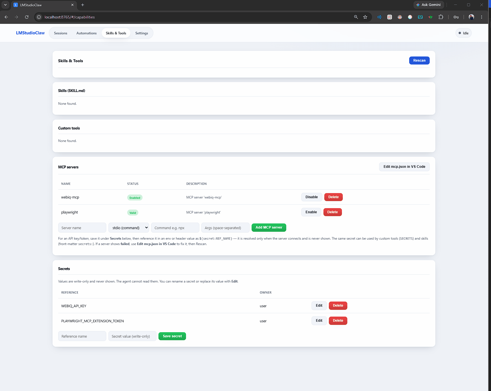
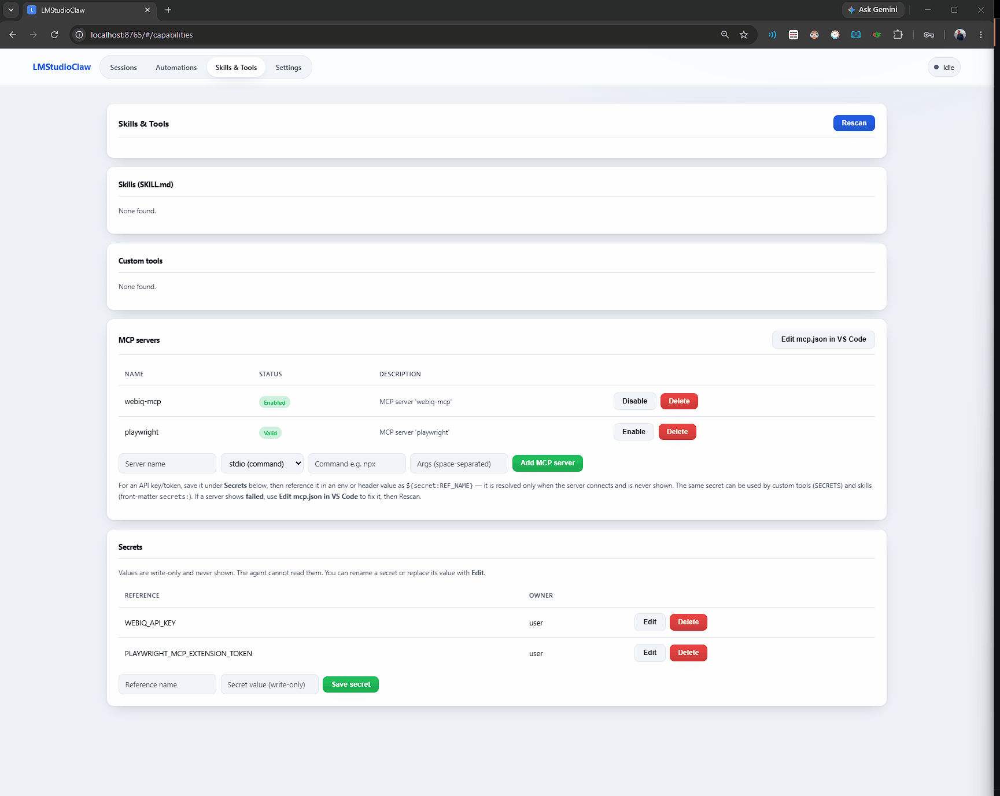
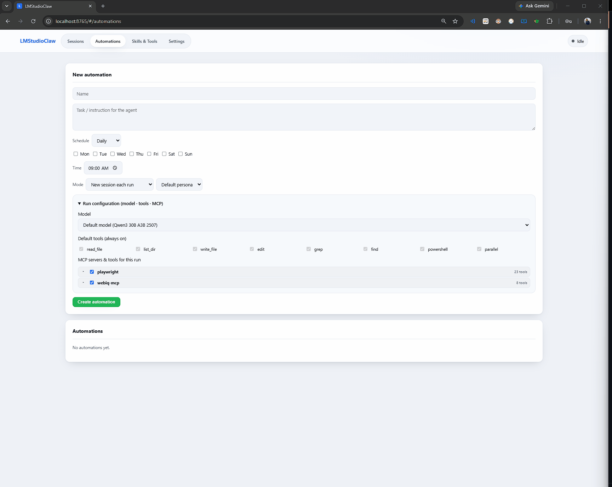

# LMStudioClaw

A Windows desktop **agent runtime** powered by your local LM Studio models. A resident
controller lives in the system tray and serves a local web control panel. It keeps **no
model loaded while idle**; when you start a session or an automation fires, it loads the
chosen model, runs an interactive agent (with skills, custom tools, and MCP servers
inside a folder-consent boundary), then unloads the model and records the run.

> This is a ground-up redesign of the original "model sync" tray app into a call-based,
> LM Studio-powered agent. The model load/unload/context functionality lives on under
> **Settings → Advanced → Model Management**.

## Why this exists

I tried **OpenClaw**, but the thing I didn't like was that it's **always on**. I game
frequently on my PC, and I didn't want an agent running 24×7 burning power and GPU
forever. I wanted something I can run **when I want to**, that also runs **automations
while my PC is on** — without a permanent background agent.

The idea was inspired by **Microsoft Cowork**, but I wanted it **native to LM Studio**
(which I already have set up). Cowork only accepts plugins — no native MCP servers — and
GitHub Copilot needs VS Code or a CLI, with no web interface I can just open in a browser.
This fills that gap: a local, on-demand, web-based agent that speaks native MCP.

Cowork natively supports skills too, but caps you at **50 custom skills**. I wanted that
skill system **with no limit** — the only cost is that your input-token budget grows as
more is loaded when a session/automation starts. I also wanted **native Python tools**,
because code is freedom in the truest sense, so I added that to my system as well.

This started life as a tiny **tkinter helper** that launched with my system to load and
unload LM Studio models (now moved into **Settings → Advanced → Model Management**). That
helper also auto-updates the loaded model in my **GitHub Copilot** and **Pi** agent
configs. I built the agent system around it after **OpenClaw**, **Cowork**, and more
recently **Microsoft Scout** got me excited about the possibilities of local agents.

Microsoft Scout is Microsoft's first "Autopilot" — an **always-on** personal agent for
Microsoft 365 (built on OpenClaw, grounded in Teams/Outlook/OneDrive/SharePoint, extended
to MCP servers), aimed squarely at the enterprise with Entra identity, Purview policies,
and Frontier enrollment. It's a great vision, but it's the opposite of what I wanted for a
personal machine: always-on, cloud/M365-bound, and enterprise-gated. LMStudioClaw takes the
same "local agent that can reach MCP servers and act for you" idea and makes it
**mostly on-demand, fully local, and personal** — no tenant, no power/GPU tax when I'm just
gaming, and nothing runs at all when the PC is off.

It's not *fully* on-demand — there are automations — but even those keep me in the loop: when
one runs, it tells me so I can watch it or stop it if I want. That's deliberate. I **don't
believe in fully autonomous agents.** They still get biased, or forget random things from
poor context engineering, so a person needs to be there watching the thinking logs and making
sure they don't mess up. Supervision is a feature here, not a missing one.

It is deliberately **not** built on the philosophy that the user must be protected from
themselves. The guardrails are for the **agent** — it must never do anything unauthorized.
But I'm handing the **user** an axe: if you want to delete `C:\Windows`, I'll let you (with
your consent). I believe in **freedom with consent**, as long as nothing too excessive
happens without you approving it.

It's a hobby project and I might forget about it soon — but for now it's like my personal
butler.

## Visual tour

> Screenshots live in [`docs/images/`](docs/images/) — drop the PNG/GIF files in there
> (the names below are placeholders) and they'll render here.

| | |
|---|---|
| **Sessions** — start a run with a model, persona, first prompt, and per-run config |  |
| **Live session** — streaming reply, readable tool cards, live token gauge |  |
| **Tool cards** — diffs for edits, input→output for MCP calls, "Open in VS Code" |  |
| **Skills & Tools** — MCP servers (stdio/HTTP), write-only secrets, missing-secret prompts |  |
| **Automations** — Daily/Interval schedules with their own run config |  |
| **Settings** — theme, model management, and **See this on your phone** (QR tunnel) |  |
| **Mobile** — responsive layout for phones/tablets |  |

## Features

- **Resident controller** — system tray + local web UI; closing the browser does not quit
  (only the tray **Quit** does). No model is loaded at idle.
- **Interactive agent sessions** — streaming output with live **steering** (Enter),
  **queuing** (Alt+Enter), **Stop**, and automatic **context compaction** near the
  context limit.
- **Single-active FIFO queue** — exactly one session runs at a time; never two models at once.
- **Consent-bounded filesystem** — the agent freely uses its whole
  `Documents\LMStudioClaw` home (workspace, skills, tools, memory, `mcp.json`) with no
  prompt, and must request hierarchical, least-privilege access to anything else
  (session or permanent grants, revocable). Secrets + app internals are never reachable.
- **Readable tool actions** — the transcript shows what the agent did as friendly cards
  ("Read X", "Created Y", "Edited Z +n −m") with an expandable side-by-side diff,
  new-file contents, a deletion note, or an MCP **input → output** panel — never the raw
  tool name. File cards offer **Open in VS Code**.
- **Per-run configuration** — pick the model, toggle individual tools, and select MCP
  servers **or individual MCP tools** (a VS Code-style tree with hover descriptions) for
  a run, without touching global settings. Change the model/config mid-session too.
- **Start with a prompt** — optionally type the first message when starting a session so
  the agent begins working as soon as the model loads.
- **See this on your phone** — expose the panel over a temporary public VS Code dev
  tunnel and scan a QR code to open it on a phone (Settings).
- **Responsive UI** — a polished React control panel that adapts to phones and tablets.
- **Automations** — Daily (weekdays + time) or Interval schedules, new or persistent
  sessions, run/missed notifications.
- **Skills, tools, MCP** — drop a `SKILL.md` folder, add a trusted custom Python tool, or
  register an MCP server (local `stdio` or remote `http`/`sse` with auth headers).
- **Isolated secrets** — stored outside any agent-reachable path; referenced as
  `${secret:NAME}` by MCP servers, custom tools (`SECRETS`), and skills. The agent can
  use a secret but can never read the value; you can rename or replace values from the UI.
- **Personas** — an editable default plus a library, selectable per session/automation.

## Install

### Easy setup (recommended for most people)

Double-click **`setup.bat`** (or run `.\setup.ps1`) from the project folder. It checks
for Python, creates the virtual environment, installs everything, builds the web UI if
Node.js is present, and tells you how to start the app. Safe to re-run any time.

Then start the app by double-clicking **`lmstudio.bat`**. On first launch a **setup
screen opens in your browser** — if your LM Studio server is protected with an API key,
paste it there and click **Save & continue**. This connection check runs every time the
app starts, so you're prompted again only if LM Studio becomes unreachable or the key
stops working.

### Manual setup (developers)

```powershell
# From the repo root (D:\Projects\LMStudioClaw)
python -m venv venv
venv\Scripts\Activate.ps1            # activate before ANY terminal command (repo rule)
pip install -e ".[dev]"              # editable install + test extras
```

Runtime dependencies (FastAPI, uvicorn, pydantic, the `mcp` SDK, tiktoken, `qrcode`, a
Windows toast library) are declared in `pyproject.toml` and installed by the command above.

> If the venv's `pip` launcher errors with a stale path, use `python -m pip ...`.

## Prerequisites

- Windows 10/11, Python 3.12+.
- **LM Studio** running locally with its server enabled (native API + `/v1`).
- At least one chat (non-embedding) model available.
- **VS Code** on PATH (`code`) for "open file" links (optional).

## Run

```powershell
lmstudio            # console-script entry point
```

On first run the controller creates `Documents\LMStudioClaw\{skills,tools,workspace,memory}`
+ `mcp.json`, an isolated secrets store under `%APPDATA%`, then starts the web server, tray,
and scheduler — with no model loaded. Use the tray **Open Control Panel** to open the UI.

Or use `lmstudio.bat` (also suitable for a `shell:startup` shortcut to launch on login).

## Control panel

- **Sessions** — start a session, watch streaming output, steer/queue/stop, manage folder
  permissions, and browse past runs.
- **Automations** — schedule Daily/Interval tasks, new vs persistent sessions, run now.
- **Skills & Tools** — enable skills, trust + enable custom tools, add MCP servers
  (choose `stdio` with a command or `http`/`sse` with a URL + auth headers), set
  secrets (write-only).
- **Brain** — an interactive view of the agent's **graph memory**: nodes (people,
  projects, facts, decisions) connected by typed relationships, rendered with cytoscape.
  Click a node to focus it (only its direct relations stay highlighted) and open a
  sidebar with that node's Markdown details. Filter by node/edge type and search by name.
  The agent builds this memory itself via tools; the page is read-only. The graph lives
  in `Documents\LMStudioClaw\graph.db` with per-node details in `memory\brain\<id>.md`.
- **Detailed session logs** — every run writes a fully-detailed JSON to
  `Documents\LMStudioClaw\logs\<session_id>.json`: the full system prompt, the exact
  messages sent to the model each turn, every tool call and its complete result in order,
  and any context-compression events (with the compressed summary). This is the audit
  trail for spotting prompt injection from skills/tools. Open `logs\index.html` (created
  on first run) to browse all logs and render any one in a prettified, ordered view
  (with a raw-JSON toggle) — it works offline; just pick the `logs` folder when asked.
  In-app, each session links to its raw log via **Audit log**.
- **Settings** — theme, default model, startup, timeouts, retention, compression threshold,
  personas, **Advanced → Model Management** (per-model context, manual load/unload/warmup),
  and **See this on your phone** (opens a temporary public VS Code dev tunnel + QR code
  to open the panel on a phone; requires the `devtunnel` CLI).

## Configuration

- Connection defaults: `lmstudioclaw/config/default.yaml` (`lmstudio.base_url`, `lmstudio.api_key`).
- Per-model context prefs: `lmstudioclaw/config/context_prefs.json` (managed in Advanced).
- Settings: stored under `%APPDATA%/LMStudioClaw/settings.json`.
- MCP servers: `Documents\LMStudioClaw\mcp.json` (standard MCP config format). Local
  servers use `command`/`args`/`env`; remote servers use `type` + `url` + auth `headers`:

  ```json
  {
    "mcpServers": {
      "files":  { "command": "npx", "args": ["-y", "server-pkg"], "env": { "KEY": "value" } },
      "remote": { "type": "http", "url": "https://host/mcp", "headers": { "Authorization": "Bearer <token>" } }
    }
  }
  ```

  Use `type` `"http"` (Streamable HTTP) or `"sse"` for remote servers; auth keys go in
  `headers` and are never logged.

## Tests

```powershell
pytest
```

## Recent improvements

- **Prettier UI** ✅ — the control panel was rebuilt as a polished React app (Vite +
  react-router + react-markdown + framer-motion) with a fluid ~90vw layout, design
  tokens, light/dark themes, and animations. It is now fully **responsive** for phones
  and tablets.
- **Readable tool cards** — file actions render as diffs / new-file / deletion views;
  MCP calls show an expandable **input → output** panel; file cards link **Open in VS Code**.
- **MCP HTTP + auth + secrets** — MCP servers support `stdio` and `http`/`sse` transports
  with auth `headers`; `${secret:NAME}` references resolve from the isolated vault at
  connect time for MCP, custom tools, and skills.
- **Per-run granularity** — choose the model, individual tools, and whole MCP servers
  **or single MCP tools** for a run; change model/config mid-session.
- **Live resilience** — tool cards and the token gauge survive a reload; the run state
  (working/idle) is replayed on reconnect.
- **Quality-of-life** — start a session with a first prompt, write-only secret rename/edit,
  "See this on your phone" QR dev tunnel, and Windows-correct `npx`/VS Code launching.

## Roadmap

- [ ] In-app skill & tool authoring tools (create/edit skills and custom tools from the UI).
- [ ] Option to run automations via the Windows Task Scheduler (PowerShell) so scheduled
  runs fire even when the app isn't open.
- [ ] Voice input (speech-to-text) via a local Whisper Docker container as another input
  format. (TTS is heavier and lower priority; STT first.)

## More

- [ARCHITECTURE.md](ARCHITECTURE.md) — modules, control flow, invariants, extension points.
- [AGENTS.md](AGENTS.md) — guide for AI agents working in this repo.
- [specs/001-agent-runtime/](specs/001-agent-runtime/) — base agent-runtime spec and design.
- [specs/002-ui-tools-concurrency/](specs/002-ui-tools-concurrency/) — UI, default toolset,
  single-run concurrency, and per-run configuration.
