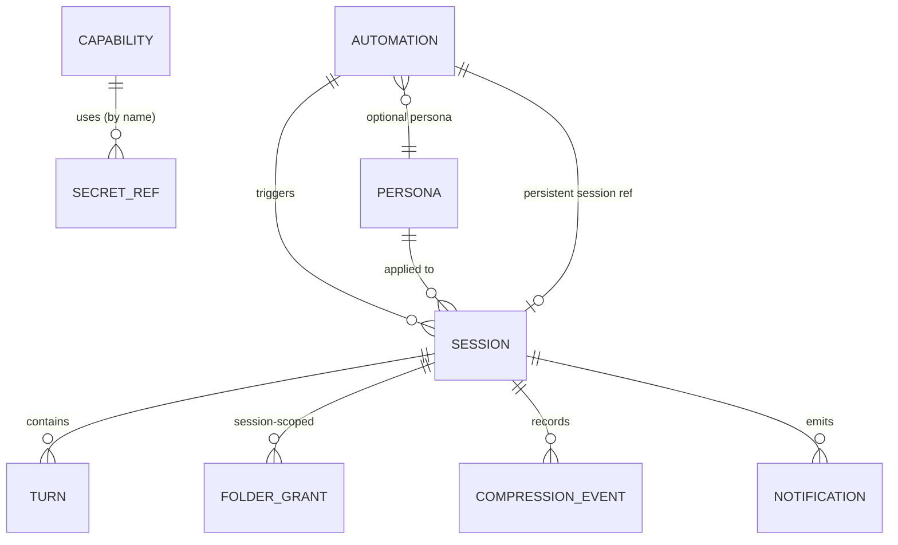

# Phase 1 Data Model: Call-Based LM Studio Agent Runtime

**Feature**: 001-agent-runtime | **Date**: 2026-06-12 | **Spec**: [spec.md](spec.md)

Structured entities are persisted in **SQLite**; capability content and config live in files (see
[research.md](research.md) §6). This document defines entities, key fields, relationships, validation
rules, and state transitions. It is implementation-guiding, not a final DDL.

---

## Entity overview



---

## 1. Session (Run)

A single agent execution — interactive (manual) or unattended (automation).

| Field | Type | Notes |
|------|------|-------|
| id | uuid | PK |
| trigger_type | enum | `manual` \| `automation` |
| automation_id | uuid? | FK → Automation (if automation-triggered) |
| persona_id | uuid? | FK → Persona (resolved default if null) |
| model_key | string | model used for the run |
| status | enum | `queued` → `loading` → `active` → (`completed` \| `failed` \| `stopped`) |
| session_mode | enum | `ephemeral` (manual/new) \| `persistent` (resumes prior) |
| started_at | datetime? | set when leaving `queued` |
| ended_at | datetime? | set on terminal status |
| failure_reason | string? | populated on `failed` |
| failure_point | string? | stage at which failure occurred |
| context_length | int | active model context window for this run |

**Relationships**: has many `Turn`, `CompressionEvent`, session-scoped `FolderGrant`; optionally
references an `Automation` and a `Persona`.

**Validation**: `automation_id` required iff `trigger_type = automation`. A terminal session is
immutable except for retention pruning.

**State transitions**:
```text
queued --(dequeued, model load starts)--> loading
loading --(model loaded)--> active
loading --(load error)--> failed
active --(user/agent completes)--> completed
active --(stop)--> stopped
active --(error / max duration / idle timeout)--> failed | stopped
```
Invariant: at most **one** session in `loading` or `active` at any time (FIFO queue, FR-008).
On any terminal status, the model MUST be unloaded (FR-002).

---

## 2. Turn

One step in a session's conversation.

| Field | Type | Notes |
|------|------|-------|
| id | uuid | PK |
| session_id | uuid | FK → Session |
| index | int | order within session |
| role | enum | `user` \| `assistant` \| `tool` \| `system` \| `steer` \| `queued` |
| content | text | message / tool result / steering text |
| tool_call | json? | tool/MCP name + arguments (assistant turns) |
| tool_result | json? | result or error (tool turns) |
| created_at | datetime | |
| token_estimate | int | contribution to the budget |

**Validation**: `steer` turns attach to an in-progress assistant turn; `queued` turns are processed
after the current turn completes (FR-057/FR-058).

---

## 3. Automation

A saved task + schedule + session mode.

| Field | Type | Notes |
|------|------|-------|
| id | uuid | PK |
| name | string | unique, user-facing |
| task | text | the prompt/instruction to run |
| schedule_type | enum | `daily` \| `interval` |
| daily_days | int[]? | weekdays (0–6) for `daily` |
| daily_time | time? | time-of-day for `daily` |
| interval_unit | enum? | `minutes` \| `hours` \| `days` for `interval` |
| interval_value | int? | every X units |
| session_mode | enum | `new` \| `persistent` |
| persistent_session_id | uuid? | the resumable Session when `persistent` |
| persona_id | uuid? | optional persona override |
| model_override | string? | optional model key |
| enabled | bool | |
| last_run_at | datetime? | drives missed-run detection |
| last_run_result | enum? | `completed` \| `failed` \| `stopped` \| `missed` |
| next_run_at | datetime? | computed |

**Validation**: `daily` requires `daily_days` + `daily_time`; `interval` requires `interval_unit` +
`interval_value > 0`. Missed-run = `now > scheduled_fire` while no run recorded for that fire (FR-031).

---

## 4. Persona

Named base-instruction set (system prompt).

| Field | Type | Notes |
|------|------|-------|
| id | uuid | PK |
| name | string | unique |
| instructions | text | system prompt body |
| is_default | bool | exactly one true; the default is editable |
| created_at / updated_at | datetime | |

**Validation**: exactly one `is_default = true`; deleting the default is disallowed (must reassign).
Counts against the token budget (FR-067).

---

## 5. Capability (Skill | Tool | MCP server)

Unified registry row for an agent capability. Content lives in files; this row is the enable/trust
state and discovered metadata.

| Field | Type | Notes |
|------|------|-------|
| id | uuid | PK |
| kind | enum | `skill` \| `tool` \| `mcp` |
| name | string | display name / tool name |
| source_path | string? | `SKILL.md` folder, tool module, or n/a for remote MCP |
| description | text? | from `SKILL.md` / tool metadata / MCP server |
| status | enum | `valid` \| `invalid` \| `disabled` \| `connect_failed` |
| enabled | bool | |
| trust_confirmed | bool | required true for `tool` before enable (FR-015) |
| secret_refs | string[] | names of secrets it needs (values never stored here) |
| added_by | enum | `user` \| `agent` (FR-079) |

**Validation**: a `tool` MUST have `trust_confirmed = true` to be `enabled`. Invalid skills
(malformed `SKILL.md`) are `invalid` and never offered (FR-017). Name collisions are flagged.

---

## 6. Folder Grant (Consent)

Permission for the agent to access a folder **and everything beneath it** (hierarchical).

| Field | Type | Notes |
|------|------|-------|
| id | uuid | PK |
| path | string | canonical absolute folder path |
| scope | enum | `session` \| `permanent` |
| session_id | uuid? | required when `scope = session` |
| access | enum | `read` \| `read_write` |
| granted_at | datetime | |
| active | bool | false once revoked |

**Validation**: a request is allowed if the canonical target equals the workspace or is prefixed by
an `active` grant's canonical `path` (hierarchical). The **secrets area and app internals are on a
hard deny-list** regardless of grants (FR-077). `session` grants are removed when the session ends
(FR-022). Traversal/symlink escapes are rejected (FR-024).

> **Pending consent request** (the `request_id` + path/access surfaced over the WebSocket while a run
> is paused) is a **transient, in-memory** object, not a persisted entity. It is resolved into a
> Folder Grant (or a denial) by the user's decision and is never stored on its own.

---

## 7. Secret

A credential value used by a capability or the model backend. Stored in the **isolated vault**
outside any agent-accessible path; the agent references it only by name.

| Field | Type | Notes |
|------|------|-------|
| ref_name | string | PK; the name capabilities reference |
| owner | enum | `backend` \| `mcp` \| `tool` |
| value | secret | stored in isolated vault file; never in SQLite, logs, or agent context |
| created_at / updated_at | datetime | |

**Validation**: only the **user** may create/edit a value (FR-078). The value is never serialized to
the agent, transcripts, or logs (FR-026/FR-077). Injected by the runtime into outbound connections
only.

---

## 8. Compression Event

Records an automatic context compaction within a session.

| Field | Type | Notes |
|------|------|-------|
| id | uuid | PK |
| session_id | uuid | FK → Session |
| at | datetime | |
| tokens_before / tokens_after | int | usage around the compaction |
| summary_turn_id | uuid | the replacement summary Turn |

---

## 9. Context Budget (in-memory, per active session)

Allocation of the active model's context window. Persisted only as usage snapshots/compression
events; primarily a runtime structure.

| Field | Type | Notes |
|------|------|-------|
| total | int | model context length |
| alloc_persona / alloc_skills / alloc_memory / alloc_conversation / alloc_tool_output | int | per-consumer budgets |
| used | int | current estimate |
| threshold | float | compression trigger (default ~0.90) |

**Validation**: sum of allocations ≤ total; crossing `threshold` triggers compaction before overflow
(FR-061/FR-068).

---

## 10. Settings / Preferences (singleton, file-backed)

| Field | Type | Notes |
|------|------|-------|
| theme | enum | `dark` \| `light` \| `system` |
| default_model | string? | |
| startup_launch | bool | launch on login, start minimized |
| notifications | json | per-event enable flags |
| web_port | int | with fallback if taken |
| lmstudio_base_url / lmstudio_api_key_ref | string | key stored by reference in vault |
| idle_unload | bool / session_idle_timeout | s |
| compression_threshold | float | default 0.90 |
| max_run_duration | int | s |
| retention_days | int | default 90 |

---

## 11. Notification

| Field | Type | Notes |
|------|------|-------|
| id | uuid | PK |
| type | enum | `automation_running` \| `automation_missed` \| `run_completed` \| `run_failed` \| `system` |
| message | text | no secrets (FR-026) |
| created_at | datetime | |
| related_session_id / related_automation_id | uuid? | |

---

## 12. Learning / Memory Note (file-backed)

Durable insight the agent persists to the memory area (files under the Documents memory folder).

| Field | Type | Notes |
|------|------|-------|
| file | path | within the memory area |
| content | text | |
| scope | enum | `global` \| automation-id | which runs load it |
| source_session_id | uuid? | provenance |
| created_at / updated_at | datetime | |

**Validation**: loaded into context subject to the token budget (FR-066/FR-067); never includes
secrets.

---

## Retention

Sessions, turns, compression events, and notifications older than `retention_days` (default 90) are
pruned at startup and after each run (FR-038/FR-051). Permanent grants, automations, personas,
capabilities, and learnings are **not** subject to time-based pruning.
