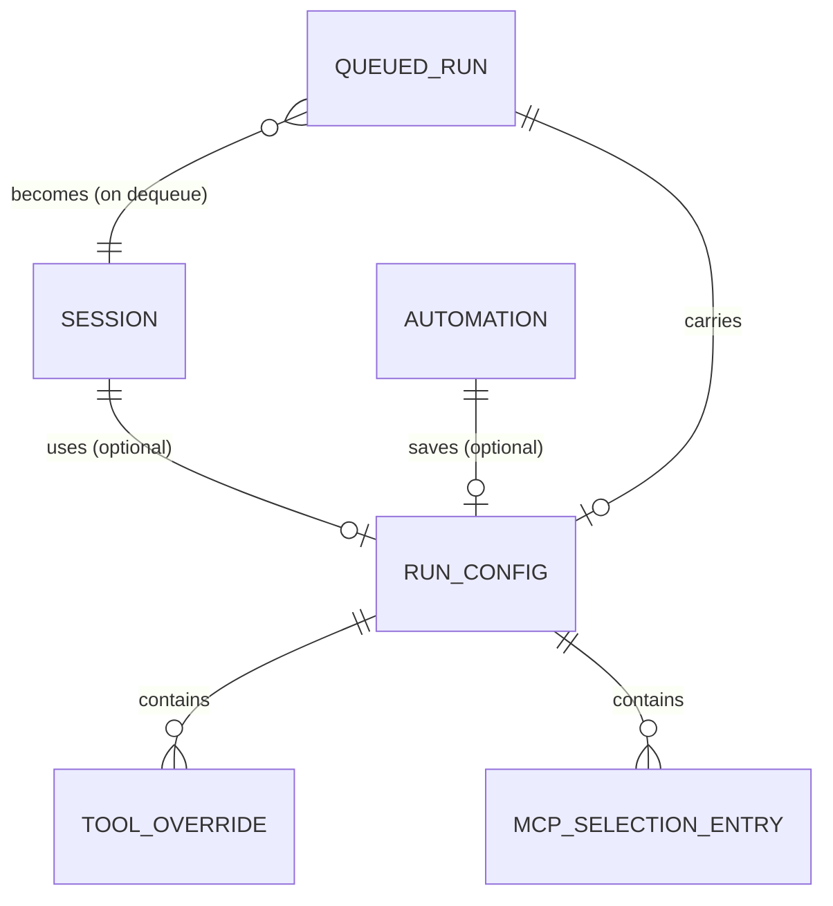

# Phase 1 Data Model: Professional UI, Default Agent Toolset & Single-Run Concurrency

**Feature**: 002-ui-tools-concurrency | **Date**: 2026-06-13 | **Spec**: [spec.md](spec.md)

This feature **extends** the `001-agent-runtime` data model (see
[../001-agent-runtime/data-model.md](../001-agent-runtime/data-model.md)). Only new entities and deltas
to existing ones are described here. Structured state stays in **SQLite** (`sessions/store.py`); config
content stays in files. This is implementation-guiding, not final DDL.

---

## Entity overview (delta)



---

## 1. RunConfig (NEW)

The optional per-run configuration attached to a session start, a follow-up that begins a new run, or a
saved automation. Absent → global defaults are used.

| Field | Type | Notes |
|------|------|-------|
| model | string? | Model key to load for this run; null → default model |
| tool_overrides | map<string,bool> | Per-tool enable(`true`)/disable(`false`) overrides, keyed by tool name. Independent of global config. Tools not listed → global state |
| mcp_selection | list<string>? | MCP server ids active for this run; null → all globally-enabled servers; `[]` → none |

**Validation**:
- `tool_overrides` keys SHOULD reference known tool names; unknown keys are ignored with a noted
  warning (FR-033), never an error.
- `mcp_selection` entries SHOULD reference known MCP server ids; unknown ids are ignored with a noted
  warning. De-selecting a server scopes it out of **this run only** — it does NOT change global state.
- Skills are NOT representable here (FR-031) — they are always globally available.

**Effective-toolset resolution (most-granular-wins, FR-030a)**:
```text
1. active_servers   = mcp_selection ?? globally_enabled_mcp_servers
2. base_tools       = builtin_tools + custom_python_tools + tools_from(active_servers)
3. effective_tools  = apply(tool_overrides) over base_tools, where each tool's
                      enabled state = override[name] if present else global_enabled[name]
```
A run may therefore keep a server active while disabling one specific tool it provides.

**Persistence & lifetime (FR-030b)**:
- For an **automation**, the `RunConfig` is saved with the automation row and applied on each run.
- For a **manual session**, the `RunConfig` is attached to the session/queued-run at start; the chosen
  values persist for that session until a **follow-up** that starts a new run supplies a new config.
- Defaults derive from global settings whenever a field is absent.

---

## 2. ToolOverride (conceptual, embedded in RunConfig)

A single per-run enable/disable decision. Modeled as a `(name, enabled)` pair inside
`RunConfig.tool_overrides`; not necessarily a standalone table.

| Field | Type | Notes |
|------|------|-------|
| name | string | Tool identity (e.g., `read_file`, `edit`, `powershell`, `grep`, an MCP tool name) |
| enabled | bool | `true` enables for this run (even if globally disabled); `false` disables for this run (even if globally enabled) |

**Invariant**: applying overrides MUST NOT mutate the global tool configuration (FR-028).

---

## 3. QueuedRun (NEW — persisted queue)

A durable record of a run waiting in (or interrupted from) the single-active FIFO queue, so the queue
survives app/PC restarts (FR-025a).

| Field | Type | Notes |
|------|------|-------|
| id | uuid | PK (matches the session id it will become / became) |
| trigger_type | enum | `manual` \| `automation` |
| automation_id | uuid? | FK → Automation (if automation-triggered) |
| run_config | json? | Serialized `RunConfig` for this run |
| initial_message | text? | Seed message for a manual run, if any |
| position | int | FIFO ordering key (monotonic) |
| started | bool | `false` while waiting; `true` once dequeued |
| created_at | datetime | enqueue time |

**Relationships**: becomes a `Session` (US1/001) when dequeued. An automation `QueuedRun` references its
`Automation`.

**State / lifecycle**:
```text
enqueue        -> row written (started=false)
dequeue        -> started=true; a Session is created/activated
cancel         -> row removed (only while started=false), Session marked stopped if it existed
complete/fail  -> row removed
startup restore-> not-started rows re-enqueued in `position` order;
                  an interrupted run (a 001 Session left in loading|active with no live process)
                  is resumed or re-queued; un-resumable manual turns are recorded + surfaced
```
**Invariant**: at most one run is `loading|active` at any time (preserves 001 FR-008 / queue invariant).

---

## 4. Session (DELTA to 001 §1)

The existing `Session` entity gains a reference to the run configuration in force.

| New/changed field | Type | Notes |
|------|------|-------|
| run_config | json? | The `RunConfig` applied to this run (null → global defaults) |

No state-machine change. The `model_key` continues to be the resolved model (now resolved from
`run_config.model` when present, else default).

---

## 5. Automation (DELTA to 001 §3)

The existing `Automation` entity gains a saved run configuration applied on each scheduled run.

| New/changed field | Type | Notes |
|------|------|-------|
| run_config | json? | Saved `RunConfig` (model + tool_overrides + mcp_selection) applied per run |

The legacy `model_override` field (001) is subsumed by `run_config.model`; for backward compatibility a
present `model_override` is treated as `run_config.model` if `run_config` is absent.

---

## 6. Tool (conceptual — capability surface, no schema change)

Tools are not a SQLite entity; they are produced by `CapabilityRegistry`. This feature defines the
**default tool set** the registry exposes and their parameter contracts (see
[contracts/delta-api.md](contracts/delta-api.md) §Tools). Each tool has a global enabled flag (existing
capability row) and an optional per-run override (via `RunConfig`).

| Tool | Targeting / params (summary) | Consent-gated |
|------|------------------------------|:-------------:|
| read_file | `{path, start_line?, end_line?}` (range optional) | yes |
| list_dir | `{path}` | yes |
| write_file | `{path, content}` (create/overwrite, makes parents) | yes |
| edit | exact: `{path, old_string, new_string}` · line-range: `{path, start_line, end_line, new_content}` | yes |
| grep | `{pattern, path?, glob?}` → matches | yes |
| find | `{glob, path?}` → file paths | yes |
| powershell | `{command, cwd?}` (workspace-rooted, timeout, truncated) | yes (consent model) |
| parallel | `{calls: [{tool, arguments}, …]}` (len ≥2, independent) | per sub-call |

---

## Notes

- No new secret-bearing fields are introduced; `RunConfig` never carries secret values (Constitution II,
  001 FR-077). MCP selection references server **ids**, not credentials.
- All new SQLite writes are best-effort (001 store convention) so a persistence hiccup never crashes the
  controller.
